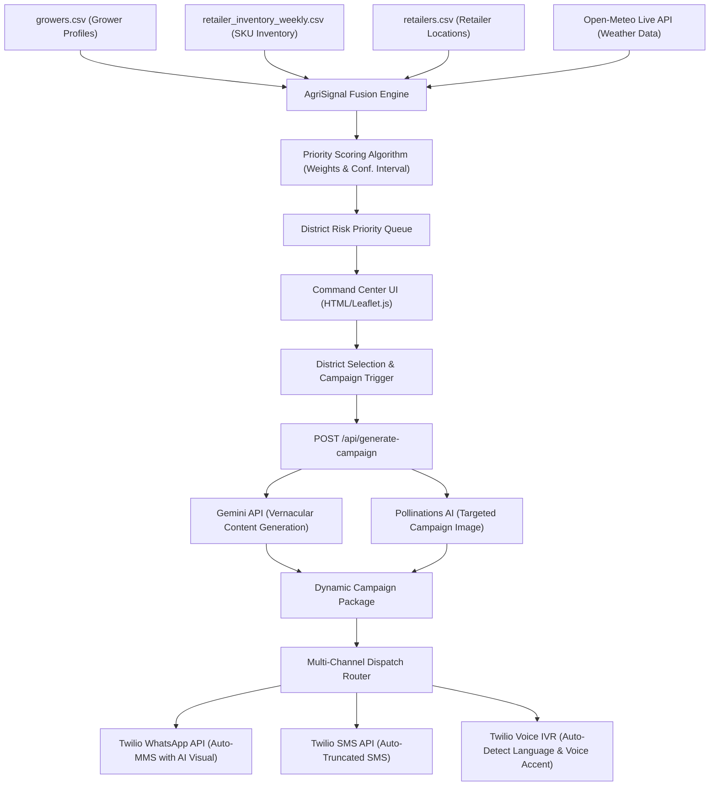

# 🌾 AgriSignal — Technical Slide Document & System Architecture
### *Autonomous Agricultural Risk Scoring & Contextual Marketing Orchestrator*
**Deployment Link:** [huggingface.co/spaces/Sarthak5628/agrisignal](https://huggingface.co/spaces/Sarthak5628/agrisignal)

---

## 📋 Executive Summary
AgriSignal is a precision agricultural marketing command center. It replaces traditional mass broadcasts with context-aware, multi-channel campaigns driven by real-time crop biology, local weather conditions, and inventory availability.

The system continuously ingests grower calendars, retail inventory data, and live meteorological feeds to calculate a dynamic risk priority queue across districts. From a unified command center, administrators can dispatch highly targeted vernacular campaigns (WhatsApp with AI-generated visuals, SMS, or Voice Call IVR) using Twilio in a single click.

---

## 🎯 The Core Agricultural Problem

Traditional agricultural input marketing treats farmers as generic consumers. This ignores the biological time windows, climate factors, and supply chain constraints of farming, leading to three massive operational failures:

1. **Temporal Mismatch (Stage & Weather):** 
   Fungi, bacteria, and pests only multiply under highly specific temperature and humidity windows during vulnerable crop growth stages. Broadcasting product ads outside these biological windows (e.g. promoting rust fungicide during dry spells or post-harvest) wastes advertising budget.
2. **Hardware & Digital Exclusion:**
   Up to **25.4% of growers** in our target regions use classic keypad/feature phones, rendering them incapable of receiving rich media or web-based alerts. Mass-marketing heavily relies on WhatsApp, completely ignoring this offline demographic.
3. **Inventory Mismatch & Stockouts:**
   Broadcasting demand-generation campaigns for products that are out of stock at the farmer's local retail branch leads to loss of sale, ad-spend waste, and grower frustration.

---

## ⚙️ System Architecture

The following block diagram represents the complete data pipeline, processing engine, and multi-channel dispatch execution sequence:



---

## 📊 Data Integration & Fusion Logic

AgriSignal joins and processes five disparate local data sources along with a live weather API to assess real-time risk without assumptions:

* **`growers.csv`:** Extracts grower metadata including `district`, `state`, `crop`, default communication `language`, `device_type` (smartphone vs. keypad), and `grower_crop_calendar` (containing sowing/harvest dates).
* **`retailers.csv`:** Pulls dealership names and precise spatial coordinates (`latitude`, `longitude`) to map distribution networks.
* **`retailer_inventory_weekly.csv`:** Pulls weekly SKU quantities per retailer to check local product stock levels.
* **`whatsapp_campaign.csv`:** Extracts historical message dispatch logs, click status, and timestamps to model engagement behaviors.
* **`retailer_pos.csv`:** Models purchase velocity (quantity sold over time) to compute retail demand warnings.
* **Open-Meteo Weather API:** Fetches hourly temperature, relative humidity, and precipitation data dynamically for each district coordinates.

---

## 🧮 Dynamic Priority Scoring Algorithm

Each district is scored dynamically to ensure complete transparency for field operators. The Priority Score represents the biological urgency of disease protection:

$$\text{Priority Score } (P) = \min\left(100, 100 \times \left[ \text{StageRisk} \times 0.40 + \text{WeatherRisk} \times 0.30 + \text{EngageScore} \times 0.20 + \text{StockScore} \times 0.10 \right]\right)$$

### 1. Weights & Core Inputs:
* **Stage Risk (40%):** Models biological crop vulnerability based on growth stage (e.g. Wheat tillering = `0.85`, flowering = `0.75`, vegetative = `0.50`).
* **Weather Risk (30%):** A biology-aware microclimate classifier that evaluates current temperature and humidity against optimal fungal breeding criteria.
* **Engagement Score (20%):** Computed from historical campaign click rates for the district segment to optimize return on investment.
* **Stock Score (10%):** Applies a penalization score (`0.9` if local inventory $\ge 10$ units, else `0.4`) to account for local distribution gaps.

### 2. Statistical Confidence Margin:
To prevent small-sample distortions, the engine computes a 95% confidence interval margin using the standard error of the score:

$$\text{Margin} = \max\left(2.0, \min\left(15.0, 1.96 \times \sqrt{\frac{P \times (100 - P)}{n}}\right)\right)$$

---

## ⛅ Biology-Aware Weather Risk Classifier

Fungal diseases like Rusts, Blights, and Mildews are highly sensitive to microclimates. Rather than using basic weather metrics, the engine implements a deterministic rule classifier:

* **Dry-Air Suppression:** If relative humidity (RH) is $< 50\%$, the risk score drops to a constant `0.05`. This prevents the system from triggering false alarms during dry, hot spells when fungi cannot germinate.
* **Relative Humidity Scale:** If relative humidity is $\ge 50\%$, the risk scales exponentially (RH 80%+ = `0.95`, RH 70%+ = `0.75`, RH 60%+ = `0.50`, RH 50%+ = `0.25`).
* **Temperature Modifier:** Multiplies risk by `1.2` if temperatures are optimal for fungal growth ($15^\circ\text{C}$ to $25^\circ\text{C}$), and divides by `0.5` under extreme heat ($> 35^\circ\text{C}$).
* **Precipitation Bonus:** Adds `+0.12` (capped at 1.0) if rain is present, which accelerates spore dispersion.

---

## 🤖 Vernacular AI Campaign Generator & Device Routing

The system automatically splits campaign delivery based on the hardware profiles in the selected district:

* **Smartphone Segment:** Routed via WhatsApp. Receives a rich-media message written in the district's dominant vernacular language (Hindi, Punjabi, Marathi, Gujarati, Kannada, Bengali) paired with a high-resolution, custom campaign graphic.
* **Keypad/Feature Phone Segment:** Routed via SMS and Voice IVR.
  * **SMS Route:** Generates a plain-text vernacular advisory message strictly limited to 130 characters.
  * **Voice IVR Route:** Generates an oral advisory script in the regional language to overcome low literacy rates.

---

## ⚡ Outbound Telephony & MMS Orchestration (Twilio API)

The backend features full API integration with Twilio to support real-time campaign dispatch:

```
[Campaign Dispatched]
         |
         +--> [WhatsApp Router] ----> Twilio MMS API (Body Text + Public Image URL)
         |
         +--> [SMS Router] ---------> Twilio SMS API (Auto-Truncated to 130 chars)
         |
         +--> [Voice Call IVR] -----> Twilio Voice API (Dynamically generates UTF-8 TwiML XML)
```

### 1. 🖼 WhatsApp MMS Visuals:
The system calls the **Pollinations AI** image generation model to dynamically render a targeted visual (e.g. *“An Indian farmer in Punjab inspecting a wheat field, hyperrealistic”*).
* **Twilio API Delivery:** The public URL is passed as the `media_url` parameter to Twilio's WhatsApp API. The image is delivered directly as a high-quality native graphic attachment with the message text as its caption.
* **Manual Browser Fallback:** If Twilio is not configured, the interface generates a click-to-chat link. It automatically appends the image link so WhatsApp's web crawlers render a rich link preview inside the message window automatically.

### 2. 🗣 Dynamic Accent and Scripting Selection (Voice Call):
Voice calls use Twilio's Amazon Polly Text-To-Speech engine.
* **Hinglish/Latin Script Detection:** If the generated text uses Latin (A-Z) characters, the backend routes the call to standard Indian English voices (`Polly.Raveena` or `Polly.Aditi`) to read the message with a natural Indian accent.
* **Indic Scripts:** Regional languages written in native alphabets (like Devanagari or Gurmukhi) are mapped to their respective Polly voices (`Polly.Aditi` for Hindi, standard `alice` voice for Gujarati, Tamil, Telugu, etc.).
* **XML UTF-8 Header Protection:** Prepends `<?xml version="1.0" encoding="UTF-8"?>` to all TwiML `<Say>` payloads. This prevents XML character parsing errors, guaranteeing regional characters (e.g., Gujarati, Bengali) are read perfectly without robotic silence.

---

## 📦 Operations: Inventory Gating & B2B Alerts

To prevent wasted marketing spend, the backend implements strict inventory validation before campaigns are compiled:

```
Campaign Requested for District D (Recommended SKU: Tilt 250 EC)
                       |
             [Check Local Stock]
                       |
         +-------------+-------------+
         |                           |
    [Stock >= 10]               [Stock < 10]
         |                           |
  Proceed to AI Campaign      BLOCK Campaign
  & Twilio Outbound Dispatch  Generate B2B Retailer Restock Alert
```

### Example Automated B2B Retailer Alert:
```json
{
  "district": "Mehsana",
  "sku": "Tilt 250 EC",
  "current_stock": 9,
  "farmers_at_risk": 82,
  "alert_message": "Mehsana Retailer Alert: 82 farmers are at risk of Karnal Bunt this week. Your stock is only 9 units. Expect incoming demand; please book restock immediately."
}
```

---

## ⚙️ Technical Credentials & Environment Variables

AgriSignal runs securely on any environment using the following environment variables:

| Environment Variable | Description | Source |
| :--- | :--- | :--- |
| `GEMINI_API_KEY` | Controls AI vernacular text copy generation (Gemini 2.5 Flash / 1.5 Flash). | Google AI Studio |
| `TWILIO_ACCOUNT_SID` | Authenticates API requests for outbound calls, SMS, and WhatsApp messages. | Twilio Console |
| `TWILIO_AUTH_TOKEN` | Secures communications between our backend server and Twilio. | Twilio Console |
| `TWILIO_FROM_NUMBER` | The registered sender phone number for SMS and Voice Calls. | Twilio Console |
| `TWILIO_WHATSAPP_FROM_NUMBER` | WhatsApp sender. Defaults automatically to Sandbox number `+14155238886`. | Twilio Sandbox |

---

## 📈 Impact & Business Metrics

We measure the success of precision campaign orchestration across biological, operational, and customer engagement dimensions:

| Dimension | Metric | Measurement Method | Expected Impact |
| :--- | :--- | :--- | :--- |
| **Engagement** | Campaign CTR | Track links clicked vs. total messages dispatched. | **15.0% - 18.0%** (up from 5% baseline) |
| **Operational**| Wasted Ad-Spend | Ratio of campaigns sent to regions with stocked-out products. | **0.0%** (via automated inventory gating) |
| **Reach** | Demographics | Count of active responses from SMS & IVR channels. | **+25.4%** coverage of offline keypad phone segment |
| **Business** | Sell-Through | POS transaction logs mapped to campaign timing. | High correlation of local sales velocity with campaign dispatch |
